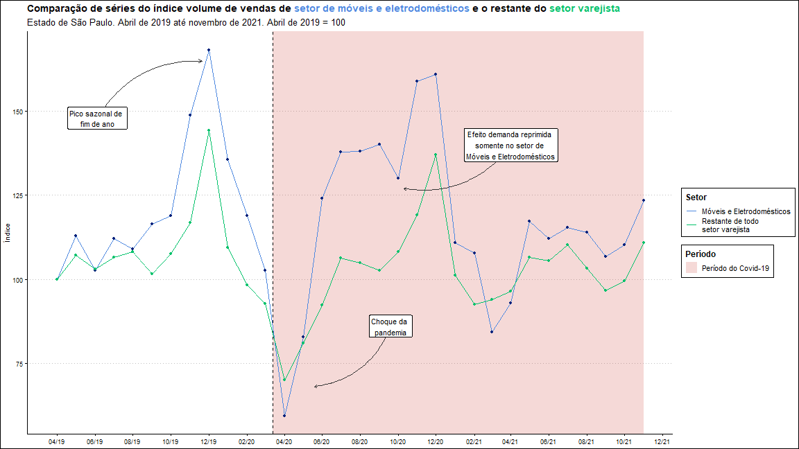
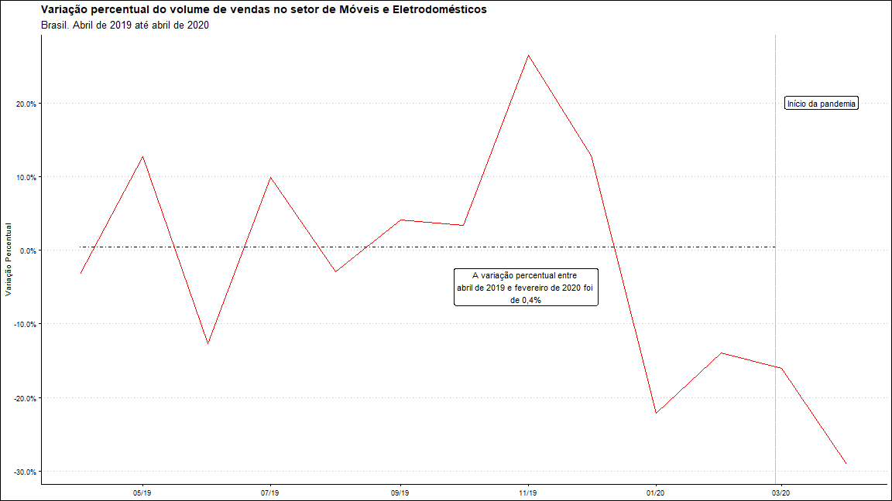
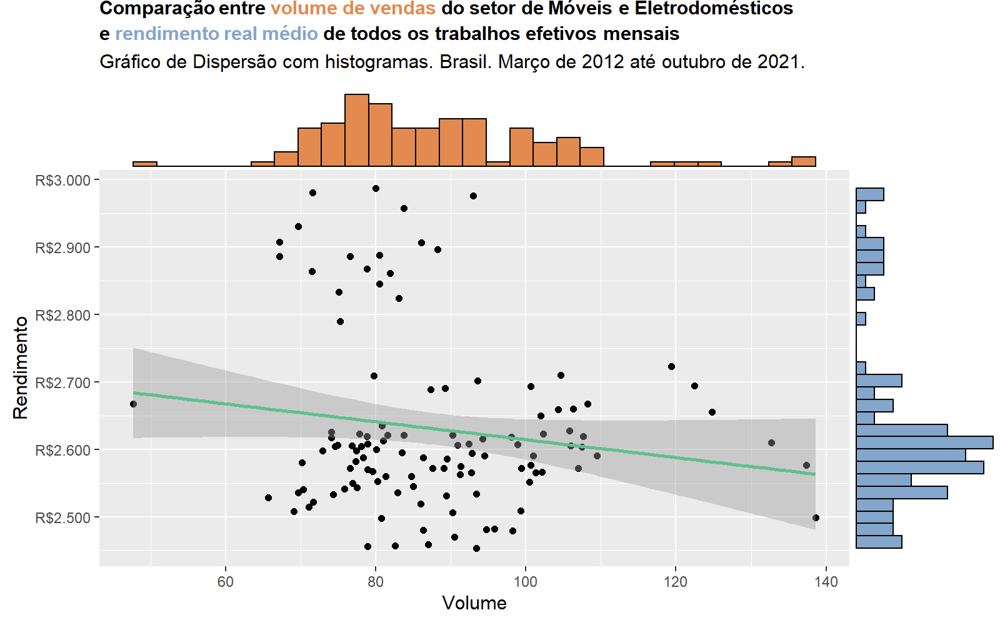

Carregando os pacotes usados

```{r Carregando pacotes, echo=TRUE, message=FALSE}
library(vars)
library(tsDyn)
library(tidyverse)
library(readxl)
library(janitor)
library(lubridate)
library(rebus)
library(zoo)
library(urca)


library(sf)
library(geobr)
library(spData)
library(viridis)
library(gifski)
library(scales)
library(ggExtra)
library(ggtext)
library(ggthemes)
```

## Parte A

**1. Importe o arquivo ”pmc.xlsx”pulando as três primeiras linhas**

```{r Importar pmc.xlsx, include=FALSE}

pmc <- read_xlsx("data/pmc.xlsx", skip = 3)
  
```

**2. Renomeie as colunas e as deixe na seguinte ordem: “data”, “var”, “setor” e colunas de localidades. Para essas últimas, utilize siglas (BR e siglas dos estados).**

```{r renomear colunas}

nomes_colunas <- c("data", "var", "setor", "br", "ce", "pe", "ba", "mg",
                   "es", "rj", "sp", "pr", "sc", "rs", "go", "df")

colnames(pmc) <- nomes_colunas
  
```

**3. Converta os valores das colunas de Brasil e UFs para que fiquem na classe numérica.**

```{r converter valores}

pmc <- pmc %>% 
   mutate(across(.cols = br:df,
                .fns = ~ suppressWarnings(as.numeric(.x))))

```


**4. Substitua os textos na coluna “var”. Faça com que assumam apenas as palavras “volume” ou “receita”, a depender de cada linha.**

```{r substituir texto var}

pmc <- pmc %>% 
  mutate(var = case_when(
           str_detect(var, pattern = "receita") ~ "receita",
           str_detect(var, pattern = "volume") ~ "volume"
         ))

```


**5. Converta a coluna “data” para que ela assuma a classe própria para data. O padrão deve ser YYYY-MM-DD. (Utilize 01 quando não houver especificado o dia).**

```{r converter data, message=FALSE, warning=FALSE}

meses <- readr::date_names_lang("pt")$mon

numero_mes <- as.character(1:12)

vetor_datas <- pmc$data

for (i in 1:12) {
  
  vetor_datas <- str_replace(vetor_datas, 
                             pattern = meses[i], 
                             replacement = paste0(numero_mes[i], "-"))
}

pmc$data <- vetor_datas

pmc <- pmc %>% 
  mutate(data = 
           str_remove_all(data, " ") %>% 
           paste0("-01") %>% 
           myd()) 

# obs.: warning referente às observações NA

```

**6. Para as colunas “data” e “var”, preencha os espaços contendo “NA” com a informação que não seja ”NA”localizada imediatamente acima.**


```{r filtrar NA}

pmc <- pmc %>% fill(data, var)

```


**7. Exclua todas as linhas em que a coluna “var” seja igual à “receita**

```{r filtrar receita}

pmc <- pmc %>% 
  filter(var != "receita")

```


## Parte B

**1. Utilize visualizações e estatísticas para comparar o setor de Móveis e Eletrodomésticos com os outros setores. Como a sede da empresa é em São Paulo, verifique o comportamento neste estado. (Dê maior destaque para o período da pandemia).**

Para a análise, vamos comparar o índice de volume do setor de Móveis e Eletrodomésticos com o índice de volume médio


```{r plot series volume varejo moveis}

pmc_geral <- pmc %>% 
  filter(setor != "Móveis e eletrodomésticos",
         data >= "2019-04-01",
         data <= "2021-11-01") %>% 
  group_by(data) %>% 
  mutate(setor = "Todos",
         across(.cols = br:df,
                .fns = ~ mean(.x, na.rm = TRUE)),
         sp = sp / 81.01429 * 100)

pmc_moveis <- pmc %>% 
  select(data, var, setor, sp) %>% 
  pivot_wider(names_from = setor,
              values_from = sp) %>% 
  filter(data >= "2019-04-01",
         data <= "2021-11-01") %>% 
  mutate(`Móveis e eletrodomésticos`  = `Móveis e eletrodomésticos` / 79.1 *100)

arrows <- data.frame(
  x1 = c(as.Date("2019-06-05"),as.Date("2020-09-19"),  as.Date("2021-04-01")),
  y1 = c(148, 86, 140),
  x2 = c(as.Date("2019-11-20"),as.Date("2020-05-19"), as.Date("2020-10-10")),
  y2 = c(165, 68, 127)
)

p_serie_mov_varej <- ggplot() +
  geom_rect(aes(xmin = as.Date("2020-03-13"), xmax = as.Date("2021-11-01"),  
                ymin = -Inf, ymax = Inf, fill = "covid"), alpha = 0.2)+
  geom_vline(xintercept = as.Date("2020-03-13"), linetype = "dashed")+
  geom_line(data = pmc_moveis, aes(data, `Móveis e eletrodomésticos`, color = "Moveis e Eletrodomesticos")) +
  geom_point(data = pmc_moveis, aes(data, `Móveis e eletrodomésticos`),
             color = "#01207a")+
  geom_line(data = pmc_geral, 
            aes(data, sp, color = "Restante de todo \nsetor varejista"))+
  geom_point(data = pmc_geral, aes(data, sp), color = "#02c26b")+
  geom_curve(data = arrows, 
             aes(x = x1, y =y1, xend = x2, yend = y2), 
             curvature = -0.3, 
             arrow = arrow(length = unit(0.07, "inch")),
             size = 0.4,
             color = "gray20")+
  annotate("label", label = "Pico sazonal de \nfim de ano",
           x = as.Date("2019-06-05"), y = 148)+
  annotate("label", label = "Choque da \npandemia",
           x = as.Date("2020-09-19"), y = 86)+
  annotate("label", label = "Efeito demanda reprimida \nsomente no setor de \nMóveis e Eletrodomésticos",
           x = as.Date("2021-04-01"), y = 140)+
  scale_x_date(date_labels = "%m/%y",
               date_breaks = "2 month",
               limits = as.Date(c('2019-03-31',"2021-11-01")))+
  scale_color_manual(name = "Setor", values = c("Moveis e Eletrodomesticos" = "#4f89e0", "Restante de todo \nsetor varejista" = "#02c26b"), labels = c("Móveis e Eletrodomésticos", "Restante de todo \nsetor varejista"))+
  scale_fill_manual(name = "Período", values = c("covid" = "#cf4238"), labels = c("Período do Covid-19"))+
  labs(title = "Comparação de séries do índice volume de vendas de <span style='color:#4f89e0;'>setor de móveis e eletrodomésticos</span> e o restante do <span style='color:#02c26b;'>setor varejista</span>",
       subtitle = "Estado de São Paulo. Abril de 2019 até novembro de 2021. Abril de 2019 = 100",
       x = NULL,
       y = "Índice")+
  ggthemes::theme_clean()+
  theme(
    plot.title = element_markdown(lineheight = 1.1)
  )

# TODO: gráfico ok
  
#obs.: gráfico melhor diagramado na imagem salva em png.

ggsave("graphics/grafico_serie_moveis_varejista.png", plot = p_serie_mov_varej, dpi = "screen", width = 16, height = 9)

```



No gráfico feito acima, percebe-se a sazonalidade no período de fim de ano para ambas as séries. Além disso, nos meses iniciais da pandemia (de março a maio), ambas as séries diminuem consideravelmente o volume de vendas. Contudo, o setor de Móveis e eletrodomésticos sofre uma alta a partir de junho de 2020 atípica, o que podemos considerar como efeito da demanda reprimida, ou algum outro fator a ser melhor estudado. O restante dos setores varejistas não sofre desse efeito, voltando ao patamar pré-pandemia.

```{r}

# TODO: criar summary statistics 

```


**2. Compare visualmente o efeito da pandemia neste setor entre os estados. Observe diferenças na intensidade e no tempo para recuperação.**

Criarei um mapa animado em formato GIF para a visualização do índice de volume de vendas do setor de Móveis e Eletrodomésticos dentre os diferentes Estados, a cada mês. Para aumentar o poder explicativo, anexado ao mapa, haverá um gráfico em barras, indicando o valor preciso do índice para cada Estado. 

```{r plot mapa - 1}

br_estados <- read_country(year = 2019, showProgress = FALSE)

br_estados <- br_estados %>% 
  mutate(abbrev_state = tolower(abbrev_state))


pmc_map1 <- pmc %>% 
  filter(setor == "Móveis e eletrodomésticos",
         data >= "2019-04-01") %>% 
  mutate(data = paste0(str_to_title(month(data, label = T)), " ", year(data))) %>% 
  filter(!is.na(br))

vetor_datas <- pmc_map1$data

# Descobrir range para ajuste de escala do mapa

temp <- pmc_map1 %>% 
  summarise(across(.cols = br:df,
                   .fns = ~ c(max(.), min(.))))
temp %>% 
  rowwise() %>% 
  summarise(max = max(c_across()),
            min = min(c_across()))

# max = 172.6
# min = 10.9

# Criar histograma para avaliar se máximo e mínimo são outliers

as.numeric(temp[1,]) %>% hist()
as.numeric(temp[2,]) %>% hist()

# Pelos histogramas, os valores escolhidos como máximo e mínimo da escala do mapa serão 172.6 e 30

```

```{r plot mapa - 2}

# Dados do gráfico

pmc_bar <- pmc %>% 
  filter(setor == "Móveis e eletrodomésticos",
         data >= "2019-04-01") %>% 
  mutate(data = paste0(
    str_to_title(month(data, label = T)), " ", year(data)
  )) %>% 
  pivot_longer(names_to = "abbrev_state",
               values_to = "volume",
               cols = br:df) %>% 
  pivot_wider(names_from = data,
              values_from = volume) %>% 
  dplyr::select(-var, -setor) %>% 
  mutate(abbrev_state = toupper(abbrev_state))


# Dados do mapa

pmc_map2 <- pmc_map1 %>% 
  pivot_longer(names_to = "abbrev_state",
               values_to = "volume",
               cols = br:df) %>% 
  pivot_wider(names_from = data,
              values_from = volume) %>% 
  dplyr::select(-var, -setor) 

for (i in seq_along(vetor_datas)) {
  
  plot_mapa <- pmc_map2 %>% 
    right_join(br_estados, by = "abbrev_state") %>% 
    ggplot(aes(geometry = geom)) +
    geom_sf(data = spData::world %>% 
              filter(continent == "South America",
                     name_long != "Brazil") , fill = "#a39e9e")+
    geom_sf(aes_string(fill = paste0("`", vetor_datas[i], "`")))+
    scale_fill_viridis(option = "D",
                       begin = 0,
                       direction = -1,
                       limits = c(10, 175))+
    annotate("label", 
             label = "Mapa animado do índice de \nvolume de vendas do setor de \nMóveis e Eletrodomésticos \nem diferentes Estados", 
             x = -21, y = -6, fontface = "bold", size =8)+
    xlim(c(-60, -10))+
    ylim(c(-33, -2))+
    labs(x = NULL,
         y = NULL)+
    theme(panel.background = element_rect(fill = "#bee5fa"),
          panel.grid = element_blank(),
          legend.position = "none",
          axis.ticks = element_blank(),
          axis.text = element_blank())+
    annotation_custom(
      
      ggplotGrob(pmc_bar %>%
                   ggplot(aes_string("abbrev_state", 
                                     paste0("`", vetor_datas[i], "`"), 
                                     fill = paste0("`", vetor_datas[i], "`")))+
                   geom_col()+
                   scale_fill_viridis(option = "D",
                                      begin = 0,
                                      direction = -1,
                                      limits = c(10, 175))+
                   geom_text(aes_string(label = paste0("`", vetor_datas[i], "`")), nudge_y = 5)+
                   labs(title = "Gráfico animado do índice de volume de vendas por Estado",
                        subtitle = "Setor de Móveis e Eletrodomésticos",
                        y = NULL,
                        x = "Estado")+
                   ylim(c(0, 175))+
                   ggthemes::theme_clean())
      ,
      xmin = -36,
      ymin = -32,
      xmax = -10,
      ymax = -16
    )
  
  ggsave(paste0("graphics/png_gif/",
                str_pad(i, width = 2, side = "left", pad = "0"), ".png"), 
         plot = plot_mapa,
         dpi = 80, width = 20, height = 12)
}


gifski(list.files("./graphics/png_gif/", full.names = TRUE), 
       "gif/mapa_grafico_volume_moveis.gif", loop = TRUE, delay = 1.5, width = 1000, height = 600, progress = FALSE)

# TODO: checar pacotes usados e passar pro começo do código
#       retirar margem branca dos mapas
    

```

O GIF permite ver as diferenças entre os Estados por meio da comparação visual de intensidade de cor no mapa e permite ver a mesma informação da maneira usual, pelo gráfico. Há uma forte queda, principalmente em março e abril de 2020, mas logo em seguida há a subida em maio a patamares anteriores. Ou seja, o setor foi afetado pelo choque de oferta, mas conseguiu se recuperar do ciclo rapidamente.


**3. Calcule a variação percentual na fase inicial da pandemia, entre abril de 2019 e abril de 2020, para todos os estados, dentro do setor de interesse. Mostre graficamente as diferenças.**

Gráfico em 1ª diferença 

```{r grafico variacao moveis}

pmc_var <- pmc %>% 
  filter(setor == "Móveis e eletrodomésticos",
         data >= "2019-03-01", data <= "2020-04-01") %>%  
  select(data, br) %>% 
  mutate(var_pct = (br / lag(br)) - 1) %>% 
  filter(data > "2019-03-01") %>% 
  mutate(label_var_pct = paste0(round(var_pct * 100, digits = 2),"%"))

# média geométrica = variação pct no período abril 2019 - fevereiro 2020
media_pre_covid <- pmc_var %>% 
  filter(data < "2020-03-01") %>% 
  summarise(media = exp(mean(log(var_pct+1)))-1) %>% as.numeric()

p_variacao <- pmc_var %>% 
  ggplot(aes(data, var_pct)) +
  geom_line(color = "red") +
  scale_y_continuous(labels = scales::percent)+
  geom_vline(xintercept = as.Date("2020-02-27"), linetype = "F1", alpha = 0.5, color = "gray50")+
  geom_segment(aes(x = as.Date('2019-04-01'), xend = as.Date("2020-02-27"),
                   y = media_pre_covid, yend = media_pre_covid), linetype = "dotdash")+
  annotate("label", label = "A variação percentual entre \nabril de 2019 e fevereiro de 2020 foi \nde 0,4%",
           x = as.Date("2019-10-31"), y = -0.05)+
    annotate("label", label = "Início da pandemia",
           x = as.Date("2020-03-20"), y = 0.2)+
  scale_x_date(date_labels = "%m/%y",
               date_breaks = "2 month",
               limits = as.Date(c('2019-04-01',"2020-04-02")))+
  labs(title = "Variação percentual do volume de vendas no setor de Móveis e Eletrodomésticos",
       subtitle = "Brasil. Abril de 2019 até abril de 2020",
       x = NULL,
       y = "Variação Percentual")+
  ggthemes::theme_clean()

ggsave("graphics/grafico_serie_pct_moveis.png", plot = p_variacao, dpi = "screen", width = 16, height = 9)

```



## Parte C


**1. Importe a base “rendimento_efetivo_real.csv”.**

```{r importar rendimento}

rendimento <- read_csv2("data/rendimento_efetivo_real.csv")

```

**2. Renomeie as colunas para que tenhamos ”data”e ”renda”.**

```{r renomear colunas parte C}

colnames(rendimento) <- c("data", "renda", "NA")

rendimento <- rendimento %>% 
  select(data, renda)

```

**3. e a coluna data para o formato YYYY-MM-DD. (Utilize 01 quando não houver especificado o dia).**

```{r converter datas}

rendimento <- rendimento %>% 
  mutate(data = parse_date_time(data, orders = "Ym"))

```

**4. Junte com a base anterior já organizada.**

```{r join}

pmc_rend <- pmc %>% 
  full_join(rendimento, by = "data") %>% 
  select(data:br, renda) %>% 
  filter(!is.na(renda))

```


**5. Gere uma visualização com as duas variáveis de interesse (note que é apenas para Brasil).**

Queremos gerar duas visualizações; scatterplot com distribuição marginal e side by side plots. Não colocaremos ambas as séries no mesmo plot pois suas escalas são diferentes.

```{r plots series e scatter}

p_rendimento <- pmc_rend %>% 
  filter(setor == "Móveis e eletrodomésticos") %>% 
  ggplot(aes(data))+
  geom_line(aes(y=renda), color = "#84a6cc")+
  scale_y_continuous(labels = scales::dollar_format(prefix = "R$",
                                                    big.mark = ".",
                                                    decimal.mark = ","),
                     breaks = seq(from = 2400, to = 3000, by = 100))+
  scale_x_datetime(date_labels = "%Y",
                   date_breaks = "1 year") +
  labs(x = NULL,
       y = "Rendimento",
       title = "**<span style='color:#84a6cc;'>Rendimento real médio</span> de todos os trabalhos efetivos mensais**",
       subtitle = "Brasil. Março de 2012 até outubro de 2021")+
  ggthemes::theme_clean()+
  theme(
    plot.title = element_markdown(lineheight = 1.1),
    legend.text = element_markdown(size = 11)
  )
  
p_volume <- pmc_rend %>% 
  filter(setor == "Móveis e eletrodomésticos") %>% 
  ggplot(aes(data))+
  geom_line(aes(y=br), color = "#e28a50")+
  scale_x_datetime(date_labels = "%Y",
                   date_breaks = "1 year") +
  labs(x = NULL,
       y = "Volume",
       title = "**Índice de <span style='color:#e28a50;'>volume de vendas</span> do setor de Móveis e Eletrodomésticos**",
       subtitle = "Brasil. Março de 2012 até outubro de 2021")+
  ggthemes::theme_clean()+
  theme(
    plot.title = element_markdown(lineheight = 1.1)
  )

p_grid <- gridExtra::grid.arrange(p_volume,p_rendimento,  heights = c(1,1), widths = c(1), nrow = 2, newpage = FALSE)

ggsave("graphics/graficos_series_rendimento_volume.png", plot = p_grid, dpi = 300, width = 16, height = 12)

p <- pmc_rend %>% 
  filter(setor == "Móveis e eletrodomésticos") %>% 
  ggplot(aes(br, renda))+
  geom_point()+
  geom_smooth(method = "lm", color = "#60bf8e", formula = y ~ x)+
  scale_y_continuous(labels = scales::dollar_format(prefix = "R$",
                                                    big.mark = ".",
                                                    decimal.mark = ","),
                     breaks = seq(from = 2400, to = 3000, by = 100))+
  labs(x = "Volume",
       y = "Rendimento",
       title = "**<span style='font-size:11pt'>Comparação entre <span style='color:#e28a50;'>volume de vendas</span> do setor de Móveis e Eletrodomésticos  \ne <span style='color:#84a6cc;'>rendimento real médio</span> de todos os trabalhos efetivos mensais</span>**",
       subtitle = "Gráfico de Dispersão com histogramas. Brasil. Março de 2012 até outubro de 2021.")+
  theme(
    plot.title = element_markdown(lineheight = 1.1)
  )

p_marg <- ggMarginal(p, type = "histogram", xparams = list(fill = "#e28a50"),
           yparams = list(fill = "#84a6cc"))

ggsave("graphics/grafico_rendimento_volume_scatter.png", plot = p_marg, dpi = 200, width = 8, height = 5)

```



**6. Crie um modelo estatístico que estime a relação entre volume de vendas de móveis e eletrodomésticos com o rendimento real médio efetivo**

Dado que os dados são duas séries temporais, é necessário estimar um modelo de séries temporais multivariado. Podemos fazer um modelo tipo VAR ou tipo VECM, a depender do resultado do teste de cointegração, com a metodologia de Johansen. Além disso, vamos fazer o teste da raiz unitária, ADF (Augmented Dickley-Fuller) para saber se as séries são não-estacionárias ou estacionárias.

```{r}

# Criando as séries

pmc_wide <- pmc_rend %>% 
  pivot_wider(names_from = setor,
              values_from = br)


serie_renda <- ts(pmc_wide$renda, start = c(2012, 03), frequency = 12)
serie_vol <- ts(pmc_wide$`Móveis e eletrodomésticos`, start = c(2012, 03), frequency = 12)

# Teste de raiz unitária

summary(ur.df(serie_renda)) 
summary(ur.df(serie_vol))

serie_renda_vol_diff <- cbind(diff(serie_renda, 1), diff(serie_vol, 1))
serie_renda_vol <- cbind(serie_renda, serie_vol)

```

Ambas as séries não rejeitaram a hipótese nula, de raiz unitária, pois os valores das estatísticas do teste são maiores que os valores de referência, logo são séries não estacionárias. Nosso modelo precisa ser I(1) para ambas séries.

Agora, descobrir a quantidade ótima de lags a serem usados

```{r}

VARselect(serie_renda_vol_diff, lag.max = 6)$selection

```
Vamos usar para a análise o método AIC, então teremos 6.

Vamos testar a cointegração, estimar o modelo VECM e testá-lo para saber se é válido.

```{r}

jotest1 <- ca.jo(serie_renda_vol, type = "eigen", spec = "longrun", K = 4)
summary(jotest1)

```
O teste sugere que rejeitemos a hipótese nula de não integração a 5%. Vamos construir então o modelo VECM

```{r}

modelo_vecm <- VECM(serie_renda_vol, 4, r = 1, estim = "ML")
summary(modelo_vecm)

# Transformar VECM em VAR para fazer o teste de autocorrelação

modelo_vecvar <- vec2var(jotest1, r = 1)
serial.test(modelo_vecvar)

```
Pelo teste, o modelo possui autocorrelação, logo não está bem especificado. Vamos fazer um modelo VAR para testar se o modelo seria melhor, pois a 1%, não há cointegração, pelo teste anterior.


```{r}

modelo_var <- VAR(serie_renda_vol_diff, p = 4)
summary(modelo_var)
coef(modelo_var)

serial.test(modelo_var, lags.pt = 5)

```
O teste de diagnóstico também indica autocorrelação, embora o p-valor seja maior do que no teste do modelo VECM.